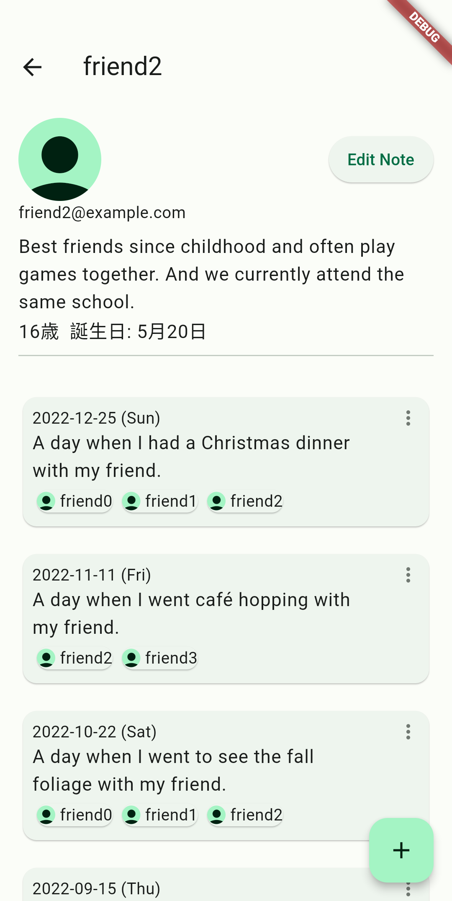
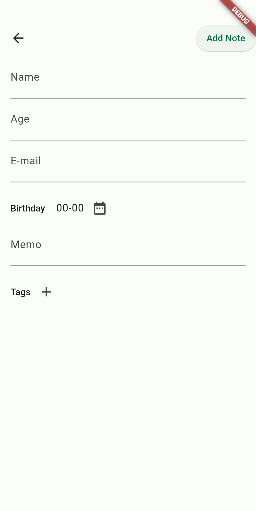

# PersonNote
 
PersonNote is an app to note people who have helped you, which allows you to store a person's name, email address, age, birthday, event, and other information and to access the same data from any device by firebase.
 
# DEMO
If you would like to check how the application works, I have made it available as a web application  [here](https://person-note-d625a.firebaseapp.com/).
Login Page | Top Page
--- | ---
 | 
Detail Page | Crate Page
 | 


 
# Usage
 
This application uses Firestore Database. Therefore, you need to create your own project if you want to run it in your environment.
```bash
git clone https://github.com/char5742/person-note
cd person_note
flutter pub get
flutter pub run build_runner build --delete-conflicting-outputs
flutter run
```

 
# License
 
"PersonNote" is under [MIT license](https://en.wikipedia.org/wiki/MIT_License).
 